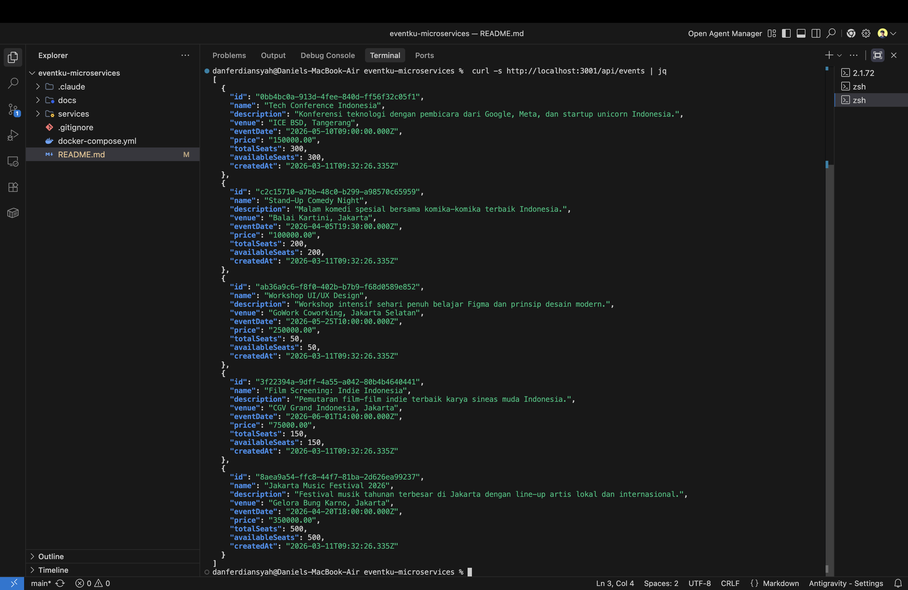
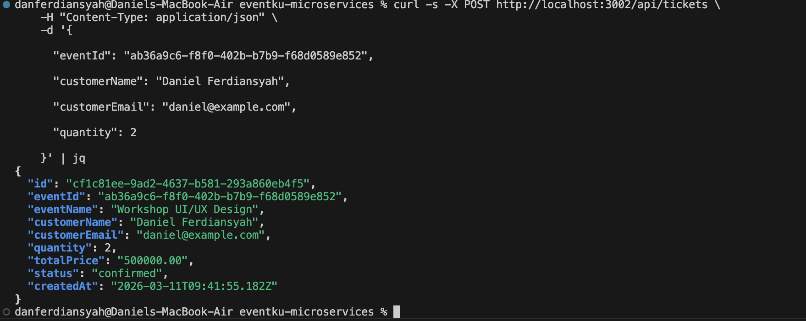
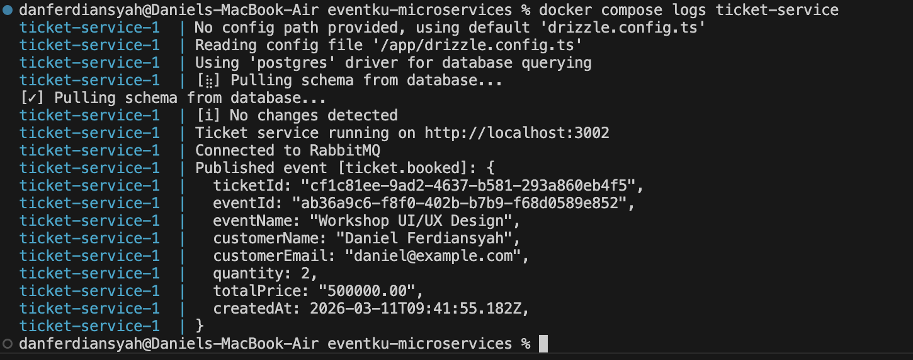
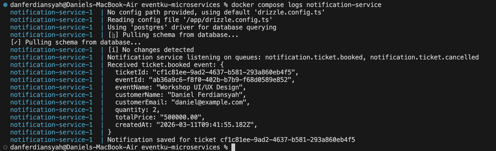
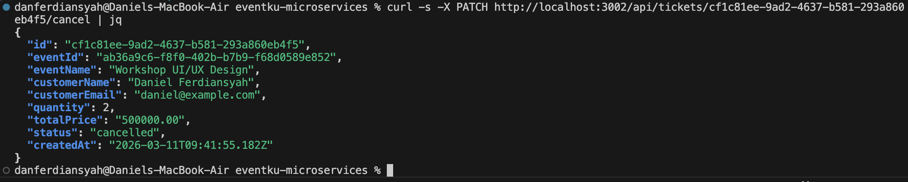
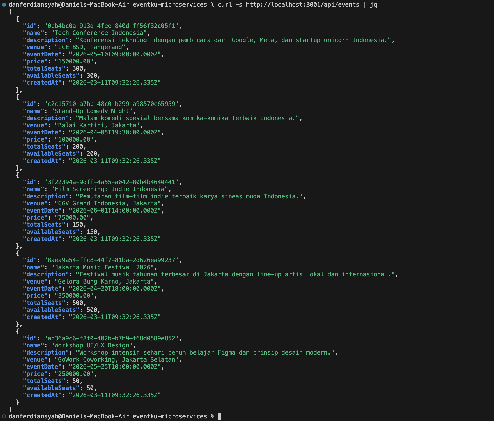
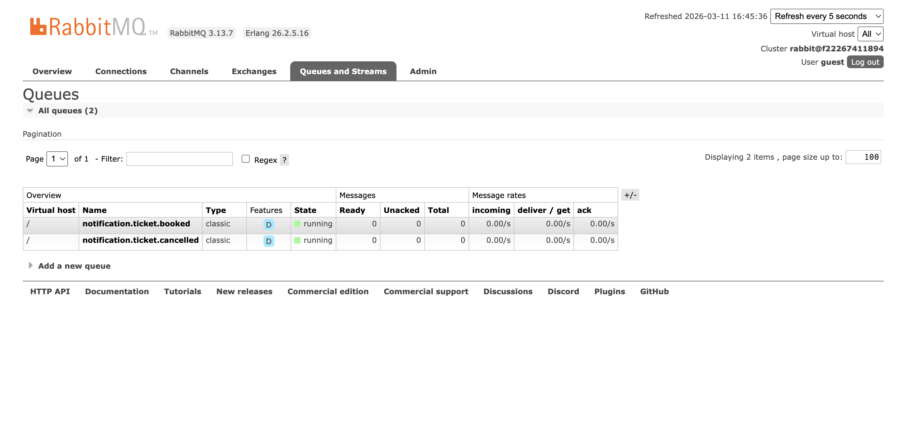
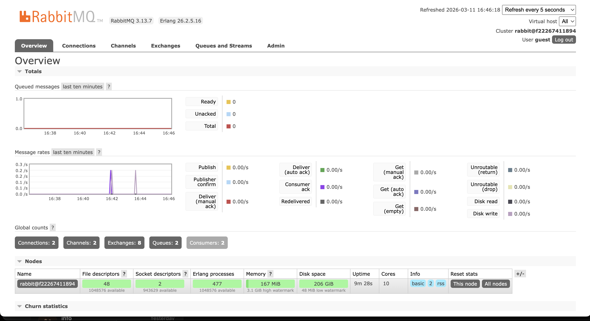
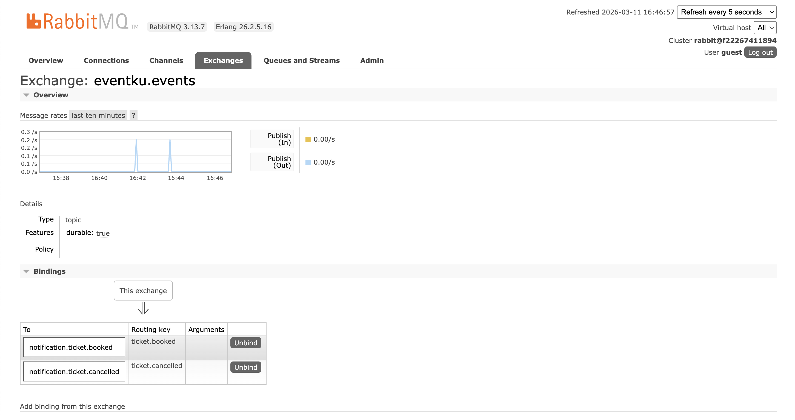

# EventKu Microservices - Workload Design

---

Daniel Ferdiansyah, 2306275052

---

Platform tiket event berbasis arsitektur microservices dengan komunikasi **Event-Driven** menggunakan **RabbitMQ**.

---

## Arsitektur Sistem

```
┌──────────────┐   HTTP    ┌──────────────────┐   HTTP    ┌─────────────────┐
│   Client     │ ────────▶ │  Ticket Service  │ ────────▶ │  Event Service  │
│  (curl/etc)  │           │  (Producer)      │           │  (Katalog)      │
└──────────────┘           └────────┬─────────┘           └─────────────────┘
                                    │
                                    │ publish
                                    ▼
                           ┌────────────────┐
                           │   RabbitMQ      │
                           │ (Message Broker)│
                           └───────┬────────┘
                                   │ consume
                                   ▼
                          ┌─────────────────────┐
                          │ Notification Service │
                          │     (Consumer)       │
                          └─────────────────────┘
```

### Service Overview

| Service | Port | Peran |
|---------|------|-------|
| **Event Service** | 3001 | Katalog event, reserve/release kursi |
| **Ticket Service** | 3002 | Booking & cancel tiket; **Producer** event ke RabbitMQ |
| **Notification Service** | - | **Consumer** event `ticket.booked` dan `ticket.cancelled` |

---

## Detail Implementasi RabbitMQ

### Exchange, Queue, dan Routing Key

| Komponen | Nama | Tipe/Detail |
|----------|------|-------------|
| **Exchange** | `eventku.events` | Tipe: `topic`, durable: `true` |
| **Queue 1** | `notification.ticket.booked` | Durable, bound dengan routing key `ticket.booked` |
| **Queue 2** | `notification.ticket.cancelled` | Durable, bound dengan routing key `ticket.cancelled` |

### Alur Event

**1. Ticket Booked (`ticket.booked`)**
```
Ticket Service ──publish──▶ eventku.events [routing key: ticket.booked]
                                  │
                                  ▼
                     notification.ticket.booked (queue)
                                  │
                                  ▼
                     Notification Service: simpan notifikasi booking ke DB
```

**2. Ticket Cancelled (`ticket.cancelled`)**
```
Ticket Service ──publish──▶ eventku.events [routing key: ticket.cancelled]
                                  │
                                  ▼
                     notification.ticket.cancelled (queue)
                                  │
                                  ▼
                     Notification Service: simpan notifikasi pembatalan ke DB
```

### Payload Event

**`ticket.booked`:**
```json
{
  "ticketId": "uuid",
  "eventId": "uuid",
  "eventName": "string",
  "customerName": "string",
  "customerEmail": "string",
  "quantity": 2,
  "totalPrice": "300000.00",
  "createdAt": "timestamp"
}
```

**`ticket.cancelled`:**
```json
{
  "ticketId": "uuid",
  "eventId": "uuid",
  "eventName": "string",
  "customerName": "string",
  "customerEmail": "string",
  "quantity": 2
}
```

---

## Cara Menjalankan

### Prerequisite
- Docker & Docker Compose

### Menjalankan Sistem

```bash
docker compose up --build
```

Perintah ini akan:
1. Menjalankan 3 database PostgreSQL (event, ticket, notification)
2. Menjalankan RabbitMQ broker
3. Build & run semua backend service (auto migrate + seed data event)

### Akses

| Layanan | URL |
|---------|-----|
| Event API | http://localhost:3001 |
| Ticket API | http://localhost:3002 |
| RabbitMQ Management UI | http://localhost:15672 (guest/guest) |

---

## Testing

### 1. Lihat Daftar Event

```bash
curl http://localhost:3001/api/events
```



### 2. Booking Tiket (Trigger Producer `ticket.booked`)


```bash
curl -X POST http://localhost:3002/api/tickets \
  -H "Content-Type: application/json" \
  -d '{
    "eventId": "<EVENT_ID>",
    "customerName": "Daniel Ferdiansyah",
    "customerEmail": "daniel@example.com",
    "quantity": 2
  }'
```



### 3. Log Producer — Event Terkirim

```bash
docker compose logs ticket-service
```



### 4. Log Consumer — Notification Service Menerima Event

```bash
docker compose logs notification-service
```



### 5. Batalkan Tiket (Trigger Producer `ticket.cancelled`)

```bash
curl -X PATCH http://localhost:3002/api/tickets/<TICKET_ID>/cancel
```



### 6. Log Consumer — Notifikasi Pembatalan

```bash
docker compose logs notification-service
```


### 7. Verifikasi Kursi Kembali

```bash
curl http://localhost:3001/api/events
```



### 8. RabbitMQ Management UI





---

## Analisis: Asynchronous vs Request-Response

### Komunikasi Sinkron (Request-Response)

Dalam EventKu, komunikasi **sinkron** digunakan untuk operasi yang membutuhkan respons langsung:
- Ticket Service memanggil Event Service via HTTP untuk mengambil detail event.
- Ticket Service memanggil Event Service via HTTP untuk mereservasi kursi.

Kedua panggilan ini **harus sinkron** karena tiket tidak bisa dibuat tanpa validasi event dan ketersediaan kursi. Jika Event Service gagal, booking langsung gagal dan user mendapat feedback instan.

### Komunikasi Asinkron (Event-Driven via RabbitMQ)

Setelah tiket berhasil dibuat atau dibatalkan, proses selanjutnya bersifat **fire-and-forget**:

1. **Notifikasi tidak menghalangi booking.** Jika Notification Service sedang down, tiket tetap berhasil dibuat. Pesan tersimpan di queue RabbitMQ dan akan diproses begitu Notification Service kembali online. Dengan model sinkron, kegagalan mengirim notifikasi bisa membuat seluruh booking gagal.

2. **Decoupling antar service.** Ticket Service tidak perlu tahu siapa yang memproses event-nya. Di masa depan bisa ditambah consumer lain (misalnya Analytics Service atau Invoice Service) tanpa mengubah kode Ticket Service.

3. **Load buffering.** Jika ada lonjakan booking (misalnya event populer baru dibuka), pesan menumpuk di queue dan consumer memprosesnya sesuai kapasitas. Tidak ada request yang hilang atau timeout.

### Mengapa Sistem jadi Lebih Resilient

- **Queue durable:** Pesan tidak hilang meskipun RabbitMQ restart.
- **Message acknowledgment:** Consumer mengirim `ack` hanya setelah berhasil memproses. Jika gagal, pesan di-`nack` dan dikembalikan ke queue untuk diproses ulang.
- **Retry logic:** Semua service memiliki mekanisme retry koneksi ke RabbitMQ (10 percobaan, interval 3 detik).
- **Compensating action:** Jika insert tiket ke DB gagal setelah kursi direservasi, kursi otomatis di-release kembali.

---

## Asumsi & Keputusan Implementasi

1. **Exchange tipe `topic`:** Dipilih agar routing key bisa menggunakan pola wildcard (misalnya `ticket.*`), memudahkan penambahan event baru ke depannya.
2. **Queue durable:** Semua queue dibuat durable agar pesan tetap tersimpan meskipun RabbitMQ restart.
3. **Message acknowledgment manual:** Menggunakan `channel.ack()` setelah pemrosesan sukses dan `channel.nack(msg, false, true)` untuk requeue saat gagal, memastikan at-least-once delivery.
4. **Compensating action sinkron:** Release kursi saat cancel dilakukan via HTTP ke Event Service karena harus segera konsisten. Notifikasi pembatalan dikirim secara asinkron via RabbitMQ.
5. **Seat reservation atomik:** Menggunakan conditional SQL update (`WHERE available_seats >= quantity`) untuk mencegah race condition saat booking bersamaan.

---

## Deklarasi Penggunaan AI

Dalam pengerjaan tugas ini, saya menggunakan **Claude Code** (oleh Anthropic) untuk membantu penulisan boilerplate kode integrasi RabbitMQ serta konfigurasi Docker Compose. Keputusan arsitektur, desain alur event, pemilihan pola komunikasi sinkron vs asinkron, serta logika bisnis aplikasi dirancang dan dipandu oleh saya sendiri.

---

## Tech Stack

- **Runtime:** Bun
- **Framework:** Elysia
- **Database:** PostgreSQL 16 (per-service)
- **ORM:** Drizzle ORM
- **Message Broker:** RabbitMQ 3 (Management Alpine)
- **Container:** Docker Compose
